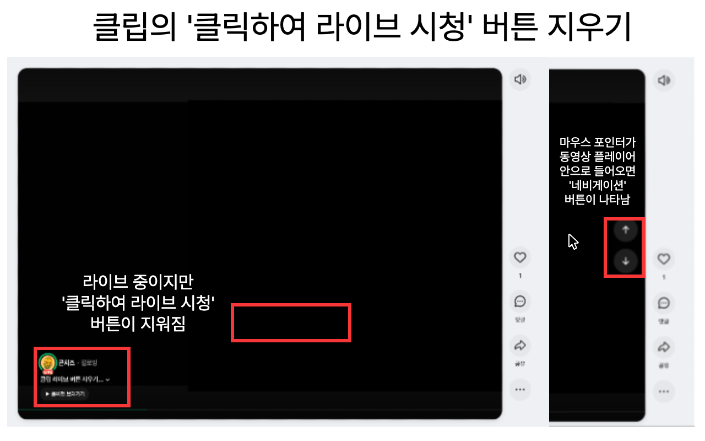

# 치지직 클립 버튼 지우개

> [!IMPORTANT]
> **⚠️ 서비스 종료 안내 (2026-08-29)**
>
> 치지직 서비스 업데이트로 인해 본 확장 프로그램의 기능이 더 이상 정상 동작하지 않습니다.
> 이에 따라 **Chrome, Edge, Whale, Firefox 등 모든 스토어에서 배포가 중단되었습니다.**
>
> 본 저장소는 코드 및 개발 이력 보존을 위해 아카이브 상태로 유지됩니다. 그동안 이용해 주셔서 감사합니다.

치지직 클립 시청 시 나타나는 '클릭하여 라이브 시청' 버튼을 숨기고, 이전/다음 내비게이션 버튼을 마우스 호버 시에만 표시하여 쾌적한 클립 시청 환경을 제공합니다.

기존 [Chzzk-Grinder](https://github.com/lirpa62/Chzzk-Grinder)에서 클립 시청 관련 기능만 분리하여 별도 배포한 확장 프로그램입니다.

  

---

## ✨ 기능

- 클립 영상의 '클릭하여 라이브 시청' 플로팅 버튼 자동 숨김
- 이전/다음 클립 내비게이션 버튼을 마우스 호버 시에만 표시
- 설치 및 업데이트 시 새로고침 안내 배너 표시

---

## 📩 문의

- **Lirpa - dev.lirpa@gmail.com**

---

본 확장 프로그램은 치지직과 관련이 없으며, 네이버, 치지직, CHZZK은 NAVER㈜의 등록상표입니다. 본 확장 프로그램을 사용하여 발생하는 결과에 대한 모든 책임은 사용자에게 있습니다.
